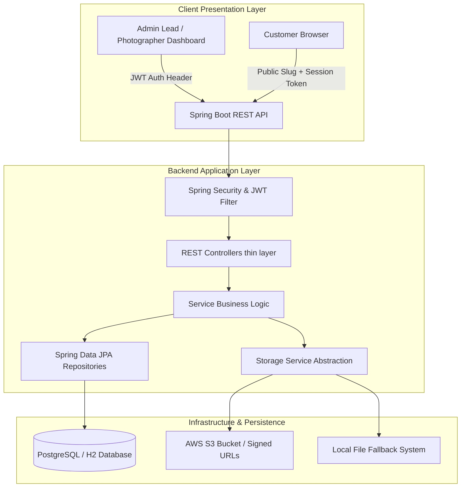
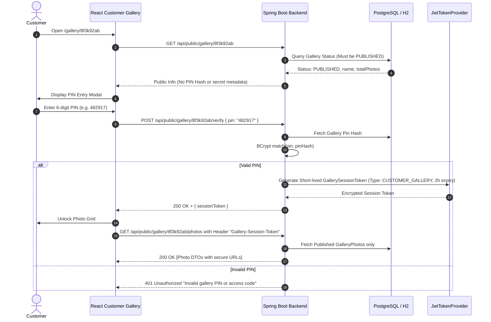

# Architecture & System Design — SnapGallery

SnapGallery is designed following a clean multi-tier architecture, separating client presentation, REST APIs, business services, database persistence, and object storage.

---

## 1. High-Level System Architecture

---

## 2. Customer PIN Verification & Security Session Architecture

To avoid forcing end customers to register accounts while ensuring high security, SnapGallery uses a **Short-Lived Gallery Access Token Pattern**:

---

## 3. Storage Abstraction Layer

SnapGallery features a pluggable `StorageService` interface:

- **Production Mode:** `S3StorageService` uses AWS SDK v2 (`software.amazon.awssdk:s3`) to generate secure signed S3 object keys (`events/{eventId}/photos/{uuid}.jpg`).
- **Development Fallback:** `LocalStorageService` stores image binaries directly into `./uploads` and streams them via Spring MVC static resource handlers.

This guarantees zero-friction local development, instant testability, and seamless production readiness.
