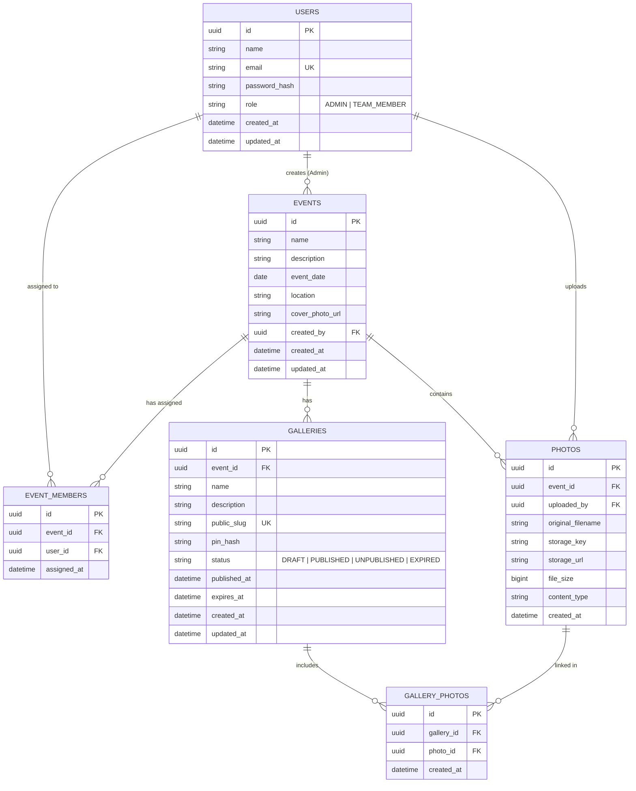

# Database Schema & Entity Documentation — SnapGallery

SnapGallery relies on a fully normalized relational schema designed for PostgreSQL.

---

## 1. Entity-Relationship Diagram

---

## 2. Table Specifications & Constraints

### Table: `users`
- `id` (UUID, Primary Key)
- `name` (VARCHAR(100), NOT NULL)
- `email` (VARCHAR(255), UNIQUE, NOT NULL)
- `password_hash` (VARCHAR(255), NOT NULL) — BCrypt Hashing
- `role` (VARCHAR(50), NOT NULL) — `ADMIN` or `TEAM_MEMBER`

### Table: `events`
- `id` (UUID, Primary Key)
- `name` (VARCHAR(150), NOT NULL)
- `description` (TEXT)
- `event_date` (DATE, NOT NULL)
- `location` (VARCHAR(255))
- `cover_photo_url` (VARCHAR(1024))
- `created_by` (UUID, Foreign Key -> `users.id`)

### Table: `event_members`
- `id` (UUID, Primary Key)
- `event_id` (UUID, Foreign Key -> `events.id`)
- `user_id` (UUID, Foreign Key -> `users.id`)
- Unique Constraint: `(event_id, user_id)`

### Table: `photos`
- `id` (UUID, Primary Key)
- `event_id` (UUID, Foreign Key -> `events.id`)
- `uploaded_by` (UUID, Foreign Key -> `users.id`)
- `original_filename` (VARCHAR(255), NOT NULL)
- `storage_key` (VARCHAR(512), NOT NULL)
- `storage_url` (VARCHAR(1024), NOT NULL)
- `file_size` (BIGINT)
- `content_type` (VARCHAR(100))

### Table: `galleries`
- `id` (UUID, Primary Key)
- `event_id` (UUID, Foreign Key -> `events.id`)
- `name` (VARCHAR(255), NOT NULL)
- `description` (TEXT)
- `public_slug` (VARCHAR(64), UNIQUE, NOT NULL)
- `pin_hash` (VARCHAR(255), NOT NULL) — BCrypt Hashed 6-digit PIN
- `status` (VARCHAR(50), NOT NULL) — `DRAFT`, `PUBLISHED`, `UNPUBLISHED`, `EXPIRED`

### Table: `gallery_photos`
- `id` (UUID, Primary Key)
- `gallery_id` (UUID, Foreign Key -> `galleries.id`)
- `photo_id` (UUID, Foreign Key -> `photos.id`)
- Unique Constraint: `(gallery_id, photo_id)`
